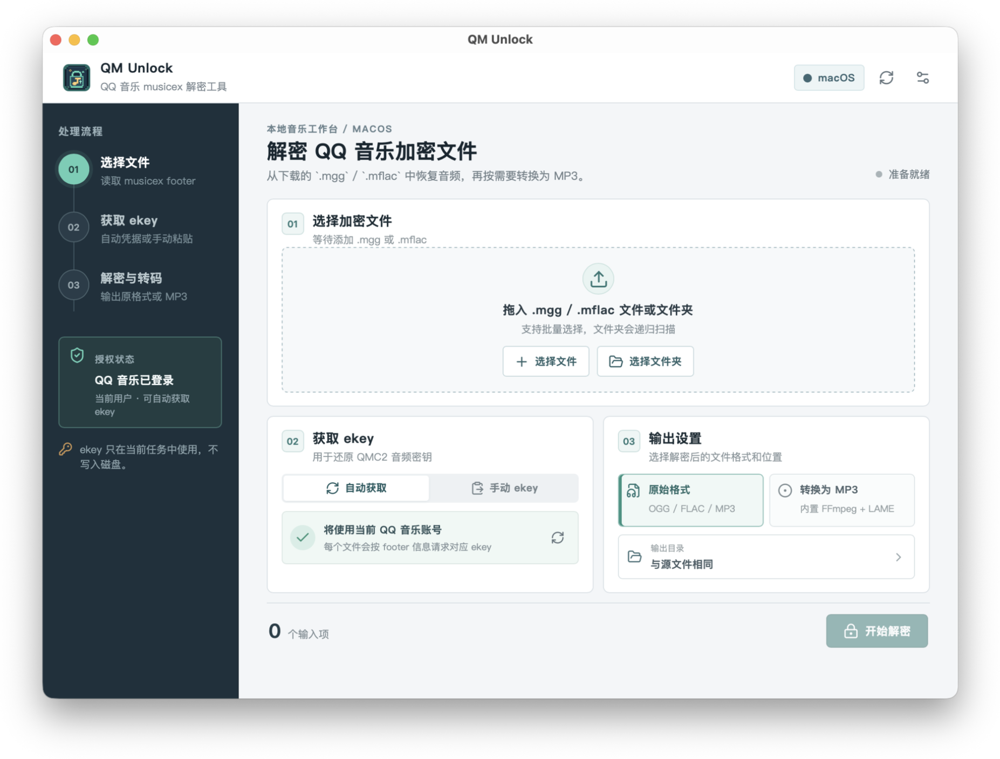
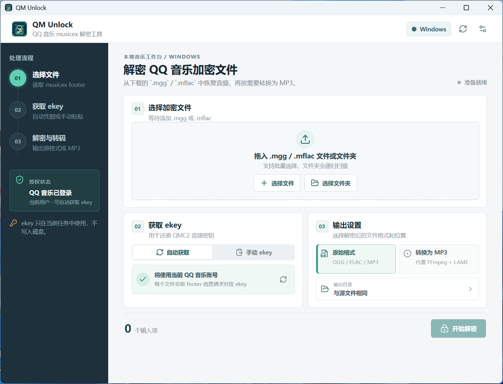

<p align="center">
  
</p>

<h1 align="center">QM Unlock</h1>

<p align="center">macOS 与 Windows 的本地 musicex 文件处理工作台</p>

<p align="center">
  
  
  
  
  
  
</p>

> **拖进去，解出来。** 新版 QQ 音乐本地加密文件，一次完成解析、解密与 MP3 转换。

QM Unlock 是一个 Rust + Tauri 2 桌面应用，处理带 `musicex V1 footer` 的本地 QQ 音乐文件。支持文件夹拖放、批量队列、实时进度、自动或手动 ekey，以及可选 MP3 转码。

| macOS | Windows |
| --- | --- |
|  |  |

## ✅ 兼容性

实测基线（版本来自 [QQ 音乐官方下载页](https://y.qq.com/download/download.html)，记录于 2026-08-25）：

| 平台 | QQ 音乐 | 状态 |
| --- | --- | --- |
| 🍎 macOS | `11.8.1` | ✅ `.mgg` / `.mflac` / `.mmp4` 均成功转换 |
| 🪟 Windows | `22.5.2` | ✅ 同格式可转换；自动 ekey 读取需与 QQ 音乐保持相同权限 |

🎵 **支持格式：** `.mgg → .ogg` · `.mflac → .flac` · `.mmp4 → .m4a` · 均可选转 **MP3**。

> ❌ **不支持旧 QMC 体系**：`.qmc*`、`.bkcmp3`、QTag、STag，以及任何不带 `musicex V1 footer` 的旧版 QQ 音乐下载文件均不在支持范围内。

> 软件按 [MIT License](LICENSE) 以“现状”提供，不附带任何担保。使用及合规责任由使用者自行承担，详见 [免责声明](DISCLAIMER.md)。

## 目录

- [特性](#特性)
- [下载安装](#下载安装)
- [快速使用](#快速使用)
- [工作方式](#工作方式)
- [ekey 获取方式](#ekey-获取方式)
- [支持范围与局限](#支持范围与局限)
- [隐私与安全](#隐私与安全)
- [常见问题](#常见问题)
- [开发与发布](#开发与发布)

## 特性

- 🖥️ **双平台**：macOS arm64（Apple Silicon）、macOS x64（Intel）与 Windows x64。
- 📂 **直接拖放**：文件、多个文件、整个下载文件夹都可以。
- ⚡ **看得见的进度**：解析、获取 ekey、解密、转码逐步显示。
- 🔑 **两种 ekey**：优先自动获取；需要时可粘贴自己的 ekey。
- 🎧 **原始格式优先**：自动输出 Ogg、FLAC、M4A 等原始音频；MP3 转码按需开启。

## 下载安装

从 GitHub 的 **Releases** 下载对应系统的安装包：

| 平台 | 下载文件 | 架构 |
| --- | --- | --- |
| 🍎 macOS（Apple Silicon） | `QM Unlock_*_aarch64.dmg` | arm64 |
| 🍎 macOS（Intel） | `QM Unlock_*_x64.dmg` | x64 |
| 🪟 Windows | `QM Unlock_*_x64-setup.exe` | x64 |

### 开发包的首次运行

macOS 包会在 DMG 创建前完成 ad-hoc 签名与完整性验证，但它不带 Developer ID；Windows 包目前也不带 Authenticode 签名。因此系统首次运行仍可能显示来源提示。

| 系统 | 可能的提示 | 处理方式 |
| --- | --- | --- |
| macOS | Gatekeeper 提示无法验证开发者 | 在“系统设置 → 隐私与安全性”中选择“仍要打开”，或在 Finder 中按住 Control 点按应用并选择“打开”。 |
| Windows | Microsoft Defender SmartScreen 提示未知发布者 | 只从本仓库 Releases 下载；确认来源后可在“更多信息”中继续。 |

面向广泛用户正式分发时，仍建议启用 macOS Developer ID 签名与公证、Windows Authenticode 签名；ad-hoc 签名不等同于开发者身份签名。

## 快速使用

1. 在 QQ 音乐中下载你有权访问的 `.mgg`、`.mflac` 或 `.mmp4` 文件。
2. 打开 QM Unlock，将文件或包含文件的文件夹拖进窗口。
3. 选择输出目录：可保留解密后的原始音频，或同时转为 MP3。
4. 保持“自动获取 ekey”开启；若自动方式失败，在界面中粘贴你已取得的 ekey。
5. 点击开始，任务卡片会显示每个文件的处理状态。完成后可直接打开输出目录。

建议先用一首文件验证流程，再批量处理整个下载目录。

## 工作方式

音频解密和转码均在本机完成；自动获取 ekey 时才会请求服务端。完整的格式解析、密钥推导和解密链路见 [解密技术说明](docs/DECRYPTION.md)。

## ekey 获取方式

### 自动获取（默认）

| 平台 | 方式 | 前提 |
| --- | --- | --- |
| macOS | 读取当前用户 QQ 音乐的本地登录信息 | QQ 音乐已登录 |
| Windows | 从正在运行、已登录的 QQ 音乐进程读取可用认证信息 | QQ 音乐正在运行；权限级别匹配 |

自动获取失败时，应用会给出可操作的原因。Windows 客户端的内部实现可能随版本变化，因而手动 ekey 是始终可用的后备方式。

### 手动 ekey（推荐的稳定后备）

在界面中选择手动模式，粘贴与该文件匹配的 ekey 后开始任务。ekey 只保留在当前运行内存中，不会写入任务历史、日志或配置文件。

### macOS Hook（高级可选后备）

仓库保留了 [`frida/`](frida) 下的 macOS 调试脚本。它适合自动读取不可用、且你需要从自己的本地客户端处理路径中取得 ekey 的情况。

- **不是桌面应用的必经步骤**；优先使用自动获取或手动 ekey。
- 仓库不包含 QQ 音乐应用本体或其副本。
- 该方案需要本机已安装的官方客户端、额外调试环境和较高的排查能力；QQ 音乐更新后可能失效。
- 请勿在 issue、截图、日志或提交中分享捕获到的 ekey、登录信息或真实音频文件。

## 支持范围与局限

| 项目 | 当前情况 |
| --- | --- |
| 输入范围 | 仅处理带 `musicex V1 footer` 的 `.mgg` / `.mflac` / `.mmp4`；其他扩展名或没有该 footer 的文件会被拒绝。 |
| 判断方式 | 以文件实际 footer 为准，不承诺某一客户端版本下载的全部资源都使用同一种封装。 |
| 旧 QMC 体系 | 不支持 `.qmc*`、`.bkcmp3`、QTag、STag 等历史格式，也不支持旧版 QQ 音乐生成、但不带 `musicex V1 footer` 的文件。 |
| ekey | 每个资源需要匹配的 ekey；应用不能凭空生成，也不能替代服务端授权。 |
| Windows 自动读取 | 依赖客户端版本和进程权限。若 QQ 音乐以管理员运行，QM Unlock 也可能需要相同权限。 |
| 损坏文件 | 下载不完整、footer 异常或 ekey 不匹配时无法正确输出音频。 |
| 转码 | MP3 是可选后处理；关闭转码时会保留识别到的原始音频格式。 |
| 账号与权限 | 应用无法改变帐号对资源的访问权限，也不承诺所有客户端版本都能自动取得 ekey。 |

## 隐私与安全

- 登录信息和 ekey 仅用于当前任务，不写入磁盘、任务历史或应用日志。
- 项目 `.gitignore` 默认排除本地捕获、真实 ekey、下载样例和构建输出。
- 不要在 issue、PR、日志或截图中提交 `authst`、ekey、QQ 号、数据库、plist、进程内存或真实音乐文件。
- 安全问题请遵循 [SECURITY.md](SECURITY.md)。

## 常见问题

<details>
<summary><strong>Windows 显示已发现 QQ 音乐，但没有读取到 authst</strong></summary>

新版 QQ 音乐可能不再把该信息保留在可读取的进程内存中；重新登录也不一定改变结果。确认 QQ 音乐已登录且两者权限级别相同后，仍失败时请改用手动 ekey。

</details>

<details>
<summary><strong>macOS 提示“无法打开”或“无法验证开发者”</strong></summary>

这是未带 Developer ID 的开发包的 Gatekeeper 提示，不代表应用已损坏。请从 Releases 或 Actions Artifacts 重新下载，再在“系统设置 → 隐私与安全性”中选择“仍要打开”。

</details>

<details>
<summary><strong>解密完成但无法播放</strong></summary>

先关闭 MP3 转码并检查原始输出格式；随后确认输入文件完整、ekey 与资源匹配。若问题可复现，请使用脱敏后的错误信息提交 Bug report。

</details>

<details>
<summary><strong>我可以不安装 FFmpeg 吗？</strong></summary>

可以。发布安装包已包含用于转码的 LGPL FFmpeg；开发模式下若随包资源不存在，才会尝试使用系统 PATH 中的 `ffmpeg`。

</details>

## 开发与发布

### 本地开发

前置条件：Node.js 20+、Rust stable，以及对应平台的 Tauri 系统依赖。

```bash
cd desktop
npm ci
npm run tauri dev
```

### 验证

```bash
cd desktop
npm run build
cargo fmt --manifest-path src-tauri/Cargo.toml --check
cargo clippy --manifest-path src-tauri/Cargo.toml --all-targets -- -D warnings
cargo test --manifest-path src-tauri/Cargo.toml

# 根目录的 Python 算法原型测试
cd ..
python3 tests/test_decrypt.py
```

### CI 与 Release

- Pull Request 和主分支推送会运行 macOS / Windows 构建验证。
- 推送 `vX.Y.Z` 标签会构建 macOS arm64、macOS x64 与 Windows x64 安装包；macOS `.app` 会 ad-hoc 签名并严格验证后再生成 DMG。
- 完整发布步骤见 [docs/RELEASING.md](docs/RELEASING.md)，变更记录见 [CHANGELOG.md](CHANGELOG.md)。

## 项目结构

```text
desktop/                  Tauri 2 桌面应用
├── src/                  React / TypeScript 界面
├── src-tauri/src/core/   Rust 解密、凭据、任务核心
└── src-tauri/resources/  随包 FFmpeg 与许可材料
qmunlock/                 Python 算法原型
frida/                    macOS 高级可选调试脚本
.github/                  CI、Release、Issue 与 PR 配置
```

## 贡献与许可

欢迎提交兼容性、体验和测试改进。提交前请阅读 [CONTRIBUTING.md](CONTRIBUTING.md)，并确保不包含任何帐号凭据、ekey 或真实媒体文件。

项目代码采用 [MIT License](LICENSE)。随包 FFmpeg / libmp3lame 按其自身 LGPL 条款分发，许可和源码说明位于 [`desktop/src-tauri/resources/ffmpeg`](desktop/src-tauri/resources/ffmpeg)。
